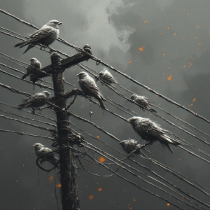

# WHEN A MAN GROWS OLD

> ### _IT ENGINEER EDITION_

 
 

 
 

## My Diaries

[Book Of 2025](./notes/2025/)

 
 
 
 
 
 
 
 
 
 
 
 
 
 
 

## Translate Text In Images

### Option 1 - Copy The Image To The Clipboard

1. Press `PrtSc` Key on your keyboard to copy
2. Go to [Google Translate](https://translate.google.com/?op=images)
3. Press `Ctrl` + `v`
4. Select your target language

### Option 2 - Save The Image To Your Drive

1. Right click and click `Save image as...` in Context Menu to save
2. Go to [Google Translate](https://translate.google.com/?op=images)
3. Click the `Choose your files` button in Blue to upload
4. Select your target language

### Images Copyrights Disclaimer

Private Images in This Repository - All rights reserved. Unauthorized use, reproduction, or distribution is prohibited.
