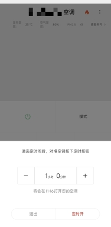

# Forget To Shut Down AC?
> ### _Oublier D'eteindre La Clim_

### 2 Decembre 2025, 23 Degres, Brouillard, Montagne du Savant, Canton, Chine

Depuis le mois dernier, j'ai commence a oublier d'eteindre mon climatiseur avant d'aller me coucher. Ca arrive souvent depuis et ca me derange pas mal.
Un cas plus grave s'est le mois dernier lorsque j'ai pris un conge sur un coup de tete et que je suis alle a la station balneaire la plus proche, je suis rentre chez mois pour decouvrir que la climatisation n'avait pas ete eteinte pendant la semaine ou j'etais absent.

J'ai explore plusieurs solutions, comme creer une alerte recurrente dans mon calendrier chaque sois pour me rappeler de verifier et d'eteindre mon climatiseur s'il est allume. Mais aucun d'entre eux ne fonctionne parfaitement jusqu'a ce que je me rappeler qu'il y a toujours eu un bouton minuterie sur la telecommande du climatiseur, que j'avais considere comme inutile depuis toujours.

Et ca fonctionne :).

 

### Images Copyrights Disclaimer

Private Images in This Repository - All rights reserved. Unauthorized use, reproduction, or distribution is prohibited.

 
