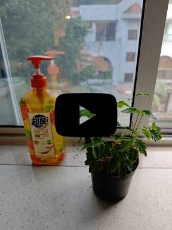
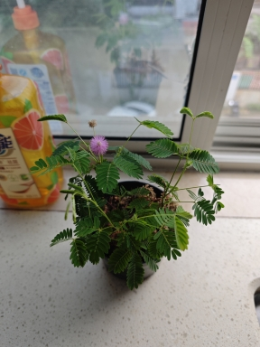

# Guiding Principles For Carrying Out An Innovation
> ### _Principes Directeurs Pour La Mise En Oeuvre D'Une Innovation_

 

### 4 Decembre 2025, 16 Degres, Nuageuse, Montagne du Savant, Canton, Chine

Pourquoi avons-nous besoin d'innovation et que voulons-nous accomplir grace a l'innovation? Dans ma vie quotidienne, j'ai resume les trois principes suivants:
1. Obtenir le resultat
2. Eviter les bloqueurs principaux
3. Eviter de generer des bloqueurs principaux supplementaires

Et j'avais besoin de masser ma plante timide ce matin.

 

### Images Copyrights Disclaimer

Private Images in This Repository - All rights reserved. Unauthorized use, reproduction, or distribution is prohibited.

 
