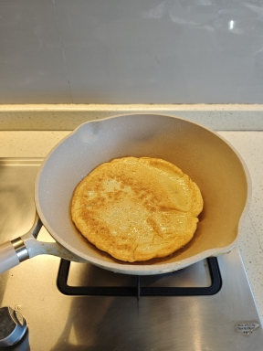

# Duel Centenaire En Cours Ici
> ### _Dans Mon Quartier Entre Chats Et Chiens _

 

### 9 Decembre, 20 Degre, Ensoleille, Montagne du Savant, Canton, Chine

Je vois tres souvent des chats errer dans la ruelle devant ma fenetre et je sais que mon voisin, quelques plus loin, a un chien.​ Depuis l'approche de l'hiver, j'entends le chien de mon voisin freiner de plus en plus fort chaque jour.​ Parfois il entend desesperement.​

De l'autre cote, j'tendents des chats miauler dehors au milieu de la nuit, souvent en journee ou lorsque la circulation est encore dense.​ Alors je realise qu'il y a des guerres qui se deroulent sur notre voie, the turf wars !​

J'ai clique sur annulation de ma commende de Magic Pills of Oder Avoidance, dit efficace pour rendre les chiens moins competitifs.​

Mais par respect pour la nature, je ne devrais jamais interevenir dans ce Duel Centenaire epoustouflant?​

 

### Images Copyrights Disclaimer

Private Images in This Repository - All rights reserved. Unauthorized use, reproduction, or distribution is prohibited.

 

[GO TO PARENT](../../)
